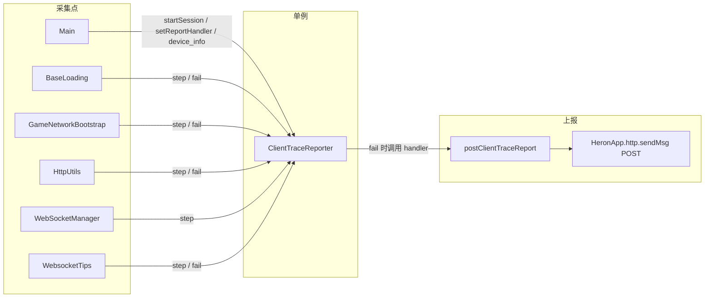
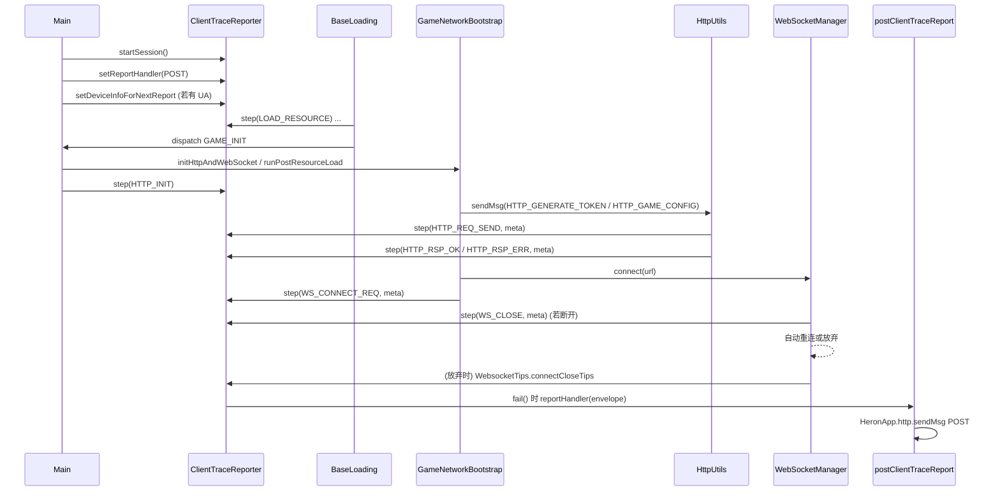

# 客户端轨迹 / 错误上报流程说明

本文梳理工程中 **「进游戏链路」客户端轨迹采集（`ClientTraceReporter`）** 与 **终态上报（`postClientTraceReport`）** 的代码步骤与数据流，便于排查与扩展。

> **源码位置**：`assets/script/diagnostics/ClientTraceReporter.ts`、`assets/script/diagnostics/clientTraceReportTransport.ts`。若本地仅有 `.meta` 而无 `.ts`，需从版本库恢复后再编译。

---

## 1. 总体架构



- **单例**：`ClientTraceReporter.getInstance()`，全局共用一个 `traceId` 与 `steps` 队列。
- **非阻塞采集**：`step()` 只追加阶段点；**真正发 HTTP** 发生在 **`fail()`** 内（通过 `setReportHandler` 注入的回调）。

---

## 2. 初始化顺序（`Main`）

文件：`assets/script/Main.ts`。

| 顺序 | 动作 | 作用 |
|------|------|------|
| 1 | `_logClientDeviceSnapshot()` | 采集 `cc.sys` + `navigator` 等；若存在 `navigator.userAgent`，调用 `setDeviceInfoForNextReport(...)`，写入 `HeronApp.data.client_device_info`，供上报 `device_info` 使用。 |
| 2 | `clientTraceReporter.startSession()` | 生成新 `traceId`，记录起始时间，并打一条 `SESSION_START` 的 `step`。 |
| 3 | `setReportHandler((envelope) => postClientTraceReport(envelope))` | 注册终态上报：后续任意 `fail()` 会组装 `envelope` 并调用 `postClientTraceReport`。 |
| 4 | `joinGame()` → `applyJoinGameNetworkUrls(host)` | 按环境写入 `HeronApp.data.HttpUrl / cusWsUrl`，以及 **`ClientTraceReportUrl`**（上报地址随环境切换）。 |
| 5 | `GAME_INIT` → `gameInit()` | `GameNetworkBootstrap.initHttpAndWebSocket()` 后 `step(HTTP_INIT)`。 |

资源加载完成后由 `BaseLoading` 等派发 `GAME_INIT`，与 `Main` 中 `gameInit` 衔接（见下节）。

---

## 3. 核心类型与 API（`ClientTraceReporter`）

实现在 `ClientTraceReporter.ts`。

### 3.1 `ClientTraceStep`（每条轨迹点）

| 字段 | 类型 | 说明 |
|------|------|------|
| `phase` | `string` | 阶段名（见 `ClientTracePhase`） |
| `offset_ms` | `number` | 相对 `startSession` 的耗时（毫秒） |
| `ts` | `number` | **绝对时间戳**（`Date.now()`，毫秒），方便和服务端日志对齐 |
| `ok` | `boolean?` | 是否成功；失败时为 `false`，成功/里程碑通常为 `true`，中性可省略 |
| `detail` | `string?` | 短说明（不再做 256 长度截断） |
| `meta` | `Record<string, unknown>?` | **结构化附加信息**（HTTP 参数 / WS 连接参数 / 断开详情等） |

`meta` 由 `_limitMeta` 做**体积控制**：当前 **不做脱敏**；仅在 `JSON.stringify(meta)` 超过 **`META_MAX_CHARS = 4096`** 时降级为：

```ts
{ truncated: true, size: <原始长度>, preview: <前 4096 字符> }
```

### 3.2 `ClientTerminalError`（终态错误，`fail` 入参）

| 字段 | 类型 | 说明 |
|------|------|------|
| `category` | `string` | 失败类别：`http_error` / `ws_disconnect` / `load_resource` 等 |
| `code` | `string?` | 业务错误码 / 失败原因常量 |
| `message` | `string?` | 简短消息 |
| `last_successful_phase` | `string?` | 最后一个成功 `phase`（不传则由 `fail` 自动推断） |
| `meta` | `Record<string, unknown>?` | 结构化附加信息；与 `step.meta` 同样走 `_limitMeta` |

### 3.3 `startSession()`

- 生成 **`trace_id`**（会话级唯一字符串）。
- 清空或初始化 **`steps`** 数组。
- 写入首条 **`SESSION_START`** step。

### 3.4 `step(phase, { ok?, detail?, meta? })`

- 追加一条 `ClientTraceStep`，自动写入 `offset_ms` 和 `ts`。
- `meta` 会经过 `_limitMeta`（只做体积控制）。
- **超过 `MAX_STEPS = 30`** 条后静默丢弃后续 step。

### 3.5 `fail(terminal)`

- 组装 `data = { flow, steps, terminal_error }`，其中 `terminal_error.meta` 也做体积控制。
- 调用 `_buildEnvelope` 组成 **`ClientTraceReportEnvelope`**：

  | 信封字段 | 典型来源 |
  |----------|----------|
  | `report_timestamp` | `Date.now()` |
  | `event_id` / `event_name` | Reporter 上可配置字段 |
  | `user_id` / `game_id` / `room_id` | `HeronApp.data` |
  | `trace_id` | 本会话 `traceId` |
  | `device_info` | `JSON.stringify(HeronApp.data.client_device_info ?? {})` |
  | `data` | `JSON.stringify({ flow, steps, terminal_error })` |

- 调用 **`reportHandler(envelope)`** → 即 **`postClientTraceReport`**。
- **随后会清空** `traceId` / `steps`，下一次 `step` 会自动 `startSession` 开新会话。

### 3.6 `setDeviceInfoForNextReport(info: object)`

- 写入 **`HeronApp.data.client_device_info`**，供下次 `_buildEnvelope` 序列化为 **`device_info`**。

---

## 4. 上报传输（`clientTraceReportTransport`）

文件：`assets/script/diagnostics/clientTraceReportTransport.ts`。

- **`postClientTraceReport(envelope, url?)`**：内部先确保 `HeronApp.http.init` 已完成，然后通过 **`HeronApp.http.sendMsg`** 对目标 URL 做 **POST**。
- **URL 选择优先级**：`url 参数` → **`HeronApp.data.ClientTraceReportUrl`**（由 `applyJoinGameNetworkUrls` 根据环境写入）→ `CLIENT_TRACE_REPORT_URL_FALLBACK`（dev 兜底）。
- **环境映射**（`assets/script/network/GameNetworkEnv.ts` 中的 `clientTraceReportUrlForHost`）：
  - `dev`：`https://gwbi.herondev.xin/report-client-trace`
  - `test`：`https://gwbi.herontest.xin/report-client-trace`
  - `trial`：`https://gwbi.herontrial.xin/report-client-trace`
  - `prod`：`https://gwbi.heronpro.xin/report-client-trace`
- **Body 字段**（与网关约定）：`ts`（对应 `report_timestamp`）、`event_id`、`event_name`、`user_id`、`game_id`、`room_id`、`trace_id`、`device_info`、`data`。
- **`returnCode: true`**：走框架 HTTP 的「仅看 HTTP 层成功」路径，避免上报自身触发业务错误码弹窗。
- **防循环上报**：`HttpUtils` 会判断 `cmd` 是否是上报接口自身（`report-client-trace` / `ClientTraceReportUrl`），**对自身请求不再打 `HTTP_REQ_SEND / HTTP_RSP_*` step**。

---

## 5. 阶段枚举 `ClientTracePhase`

所有常量定义于 `ClientTraceReporter.ts`。

| 常量 | 含义 |
|------|------|
| `SESSION_START` | 会话开始 |
| `HTTP_INIT` | HTTP 模块已初始化（`Main.gameInit`） |
| `HTTP_REQ_SEND` | **发起 HTTP 请求**（meta：`cmd / method / params / returnCode`） |
| `HTTP_RSP_OK` | **HTTP 响应成功**，业务 `code==0`（meta：`cmd / code / msg / data / returnCode`） |
| `HTTP_RSP_ERR` | **HTTP 响应业务错误**（meta 同上） |
| `HTTP_ERROR` | HTTP 业务失败或资源加载失败等（由 `disErrorCode` / `loadErrorCodes` 触发） |
| `LOAD_RESOURCE` | 公共资源 / 语言 / 游戏资源等加载步骤 |
| `WS_CONNECT_REQ` | **发起 WebSocket 连接**（meta：`url / game_id / user_id / room_id / base_score / is_create_party / party_name / autoReconnect / token / sign / room_auth`） |
| `WS_CONNECT` | WebSocket 连接成功（`CONNECT_SUCCESS`） |
| `WS_CLOSE` | 底层 `onclose`（**meta：详见 §6.4**） |
| `WS_REQ_SEND` | 已发出 WS 请求 |
| `WS_RSP_OK` | 收到合法包头且业务分发成功的响应 |
| `WS_HEADER_ERROR` | 包头 `errorCode !== 0` |
| `WS_GIVE_UP` | 不再自动重连（耗尽 / 关闭策略 / 主动拒绝等，**meta：详见 §6.5**） |
| `JOIN_ROOM` | 加入房间（预留） |
| `ENTER_SCENE` | 进入场景（预留） |

---

## 6. 各文件中的调用关系

### 6.1 `BaseLoading`（`assets/script/base/BaseLoading.ts`）

| 触发条件 | 调用 |
|----------|------|
| `loadCommon` 成功 | `step(LOAD_RESOURCE, { ok: true, detail: 'common' })` |
| `loadEmoji` 成功 | `step(LOAD_RESOURCE, { ok: true, detail: 'emoji' })` |
| `loadLanguage` 成功 | `step(LOAD_RESOURCE, { ok: true, detail: 'language' })` |
| `loadGameRes` 成功 | `step(LOAD_RESOURCE, { ok: true, detail: 'game_res' })` |
| `common` / `gameRes` 加载失败 | `fail({ category: 'load_resource', ... })` |
| 资源队列 `onComplete` | `step(LOAD_RESOURCE, { ok: true, detail: 'load_queue_complete' })` |
| `NetDefine.CONNECT_SUCCESS` | `step(WS_CONNECT, { ok: true })` + 原有进房进度逻辑 |

### 6.2 `GameNetworkBootstrap`（`assets/script/network/GameNetworkBootstrap.ts`）

| 触发条件 | 调用 |
|----------|------|
| `loadErrorCodes` 加载 `csv/error_codes` 失败 | `step(HTTP_ERROR, ...)` → **`fail({ category: 'http_error', code: 'error_codes_csv', ... })`** |
| **`connectServer(url, token)`** 发起 WS 连接前 | **`step(WS_CONNECT_REQ, { detail: url, meta: { url, game_id, user_id, room_id, base_score, is_create_party, party_name, autoReconnect, token, sign, room_auth } })`** |

### 6.3 `HttpUtils`（`assets/script/network/HttpUtils.ts`）

| 触发条件 | 调用 |
|----------|------|
| `handlerRequestPackage`（发起任意 HTTP） | **`step(HTTP_REQ_SEND, { detail: cmd, meta: { cmd, method, params, returnCode } })`**（上报接口自身不打点） |
| `handlerResponsePackage`（HTTP 200 返回） | 业务 `code == 0`：**`step(HTTP_RSP_OK, { ok: true, detail, meta: { cmd, code, msg, data, returnCode } })`**；否则：**`step(HTTP_RSP_ERR, { ok: false, ... })`** |
| `disErrorCode`（`respData.code != 0`） | `step(HTTP_ERROR, ...)` → **`fail({ category: 'http_error', code: String(respData.code), ... })`**，并弹 `COMMONUIID.alert` |

### 6.4 `WebSocketManager`（`extensions/heron-framework/.../WebSocketManager.ts`）

| 触发条件 | 调用 |
|----------|------|
| `sendMsg` 发送 | `step(WS_REQ_SEND, { detail: cmd })`（心跳等可能被排除） |
| 收到合法响应且非噪声 cmd | `step(WS_RSP_OK, { detail: cmd })` |
| `onConnected` | 记录 `_lastOpenAt = Date.now()`（供 close 计算连接时长；无 step） |
| `onClosed` | **`step(WS_CLOSE, { ok: false, detail, meta: lastWsCloseInfo })`**，meta 结构见下 |

**`WS_CLOSE.meta` / `getLastWsCloseInfo()` 快照结构**：

```ts
{
  code: number,              // 原生 close code（1000/1006/...）
  reason: string,            // 原生 close reason
  wasClean: boolean,
  ts: number,                // 绝对时间戳
  durationSinceOpenMs: number,  // 从 onConnected 到 close 的耗时；未曾连上为 -1
  stateBeforeClose: string,     // 关闭前状态：连接中/验证中/可传输数据/已关闭
  autoReconnect: {
    initial: number | null,   // 首次 connect 时的 autoReconnect 策略
    remaining: number,        // 当前剩余可重连次数
    used: number | undefined, // 已用次数（仅对 initial > 0 有效）
    userRejected: boolean,    // rejectReconnect 是否被置位
    exhausted: boolean,       // 重连次数耗尽
    willAutoReconnect: boolean, // 本次 close 后是否还会继续自动重连
  },
  pendingRequests: number,     // 关闭时请求队列长度
  isSocketOpenBefore: boolean, // 是否曾连接成功过
}
```

新增公共方法 **`getLastWsCloseInfo()`**：供 `WebsocketTips` / 其他诊断读取最近一次 close 快照。

### 6.5 `WebsocketTips`（`assets/script/network/WebsocketTips.ts`）

| 触发条件 | 调用 |
|----------|------|
| `responseErrorCode`（包头业务错误码） | `step(WS_HEADER_ERROR, { ok: false, detail: 'code:N' })`；**不调用 `fail`**，由业务错误表决定弹 toast/alert |
| `connectCloseTips(reason)`（放弃重连） | `step(WS_GIVE_UP, { ok: false, detail: reason, meta })` → **`fail({ category: 'ws_disconnect', code: reason, message, meta })`** |

**`WS_GIVE_UP.meta` 与 `terminal_error.meta` 结构**：

```ts
{
  giveUpReason: 'reconnect_exhausted' | 'user_reject_reconnect'
              | 'no_auto_reconnect' | 'disconnect_no_reconnect',
  lastClose: <WebSocketManager.getLastWsCloseInfo() 快照>,
}
```

---

## 7. 端到端时序（简图）



**要点**：正常进房过程中多为 **`step` 累积**；一旦出现 **`fail`**，当前会话的 **`steps` + `terminal_error`** 会一次性上报，然后会话状态在 Reporter 内被重置。

---

## 8. 数据处理规则（体积控制 / 不做脱敏）

当前实现 **不对 meta 做字段级脱敏**（token / sign / room_auth 等均原样上报）。仅做以下体积控制：

| 规则 | 触发条件 | 处理 |
|------|----------|------|
| 单次 `meta` 体积限制 | `JSON.stringify(meta).length > 4096` | 降级为 `{ truncated: true, size, preview }` |
| 步数上限 | `steps.length >= MAX_STEPS (=30)` | 静默丢弃后续 `step` |
| 防循环上报 | `cmd` 指向 `report-client-trace` / `ClientTraceReportUrl` | 不打 `HTTP_REQ_SEND / HTTP_RSP_*` step |

> **线上建议**：进入稳定阶段后，应视合规要求恢复对 `token / game_token / sign / room_auth / password / secret` 等字段的脱敏，避免凭证经 BI 网关落地。

---

## 9. 扩展与排查建议

1. **新增阶段**：在关键业务处调用 `ClientTraceReporter.getInstance().step(phase, { detail, meta })`，保持 `phase` 稳定字符串便于统计。
2. **新增终态**：需要上报并结束会话时调用 **`fail`**；若只需记日志不打断会话，可只用 **`step`** 或另行扩展 API（需改 `ClientTraceReporter.ts`）。
3. **`device_info` 为空**：检查 `Main._logClientDeviceSnapshot` 是否在无 `navigator` 的环境运行，或 `userAgent` 为空未写入 `client_device_info`。
4. **重复 `WS_CONNECT` step**：若 `BaseLoading` 与 `NetworkEntryFlow` 等同时对 `CONNECT_SUCCESS` 打点，可能重复，合并时保留一处即可。
5. **环境上报地址错误**：若 `HeronApp.data.ClientTraceReportUrl` 为空，会回退到 `CLIENT_TRACE_REPORT_URL_FALLBACK`（dev）；确认 `Main.joinGame` 里 `applyJoinGameNetworkUrls(this.networkHost)` 已执行。
6. **`fail()` 之后的 step 会开新会话**：若业务在 `fail` 后还有后续动作需要追踪，请显式再次 `startSession()` 或允许自动开新会话（新 `trace_id`）。

---

## 10. 相关文件索引

| 路径 | 角色 |
|------|------|
| `assets/script/diagnostics/ClientTraceReporter.ts` | 单例、step/fail、信封组装、`ClientTracePhase` / `ClientTraceStep` / `ClientTerminalError` 定义 |
| `assets/script/diagnostics/clientTraceReportTransport.ts` | POST 网关；URL 按 `HeronApp.data.ClientTraceReportUrl` 读取 |
| `assets/script/network/GameNetworkEnv.ts` | 环境 → URL 映射（`httpUrlForHost` / **`clientTraceReportUrlForHost`**） |
| `assets/script/Main.ts` | 会话开始、handler、device_info、GAME_INIT |
| `assets/script/base/BaseLoading.ts` | 资源加载、WS 连接成功 |
| `assets/script/network/GameNetworkBootstrap.ts` | 错误码表加载失败、`WS_CONNECT_REQ` |
| `assets/script/network/HttpUtils.ts` | `HTTP_REQ_SEND` / `HTTP_RSP_OK` / `HTTP_RSP_ERR` / `HTTP_ERROR` + `fail` |
| `extensions/heron-framework/assets/core/netWork/WebSocketManager.ts` | `WS_REQ_SEND` / `WS_RSP_OK` / `WS_CLOSE` + `getLastWsCloseInfo` |
| `assets/script/network/WebsocketTips.ts` | WS 包头错误、`WS_GIVE_UP` + `fail({ meta })` |

---

*文档随工程迭代可继续补充「成功路径主动 flush」「采样率」「按环境切换脱敏」等设计；若与实现不一致以源码为准。*
